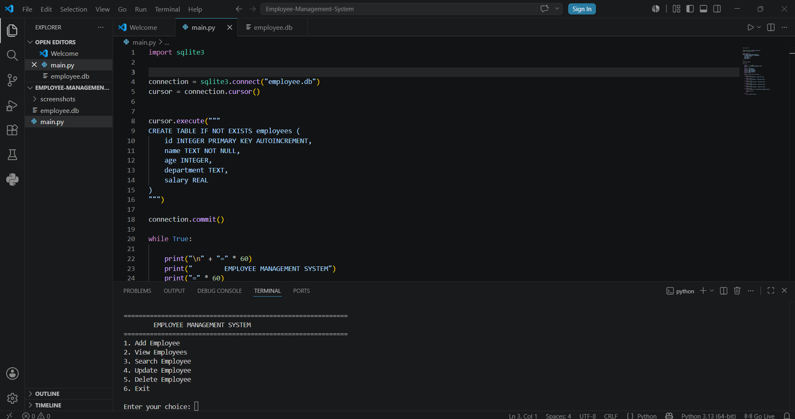

# 👨‍💼 Employee Management System

A simple Employee Management System built using **Python** and **SQLite**. This project allows users to manage employee records through a command-line interface.

## 🚀 Features

- Add Employee
- View All Employees
- Search Employee by ID
- Update Employee Details
- Delete Employee
- Store Data Using SQLite Database

## 🛠 Technologies Used

- Python
- SQLite3

## 📁 Project Structure

```
Employee-Management-System/
│
├── main.py
├── employee.db
└── README.md
```

## ▶️ How to Run

1. Clone the repository

```bash
git clone https://github.com/yourusername/Employee-Management-System.git
```

2. Open the project folder

```bash
cd Employee-Management-System
```

3. Run the program

```bash
python main.py
```

## 📷 Screenshots

Add your project screenshots here.

Example:

```markdown

```

## 📚 What I Learned

- Python Programming
- SQLite Database
- CRUD Operations
- SQL Queries
- Database Connectivity
- Command-Line Interface (CLI)

## 🚀 Future Improvements

- Search by Employee Name
- Login Authentication
- Export Data to Excel
- Graphical User Interface (GUI)

## 👨‍💻 Author

**Arnav Verma**

GitHub: https://github.com/vermaarnav590-a11y

---

⭐ If you like this project, consider giving it a star.
